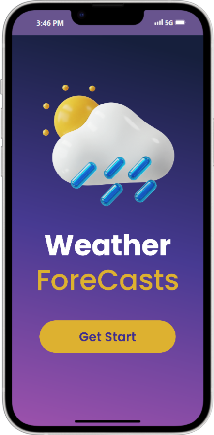
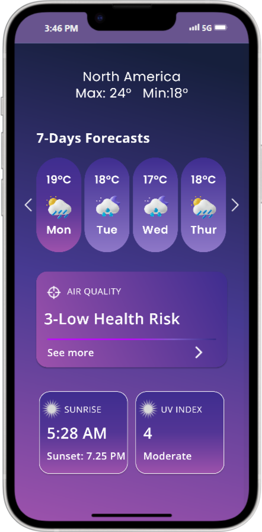
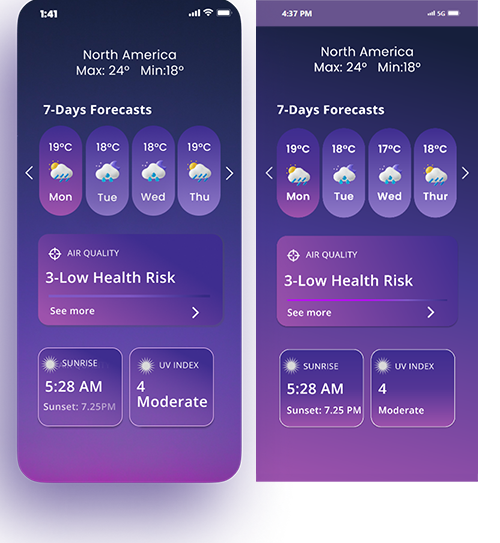
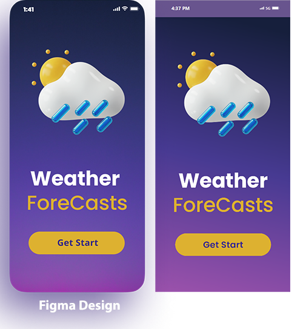
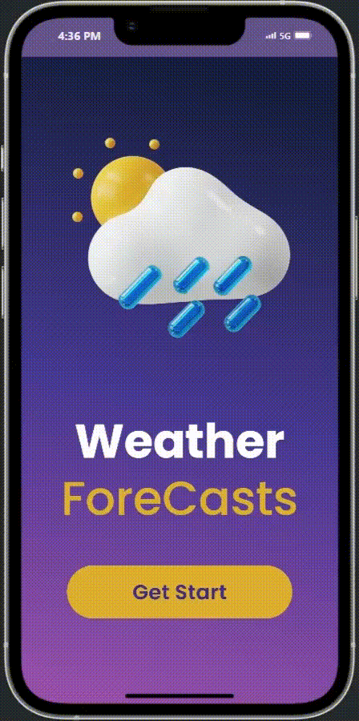

# A Weather App UI Conversion from Figma Design

 

## About the project

This project is a User Interface (UI) conversion of a weather application based on figma design. It purely focuses on frontend UI part of the application using flutter. 

## Comparison Between the Design and the Project

### Get Start Page

### Home Page

## A Quick Demo of the Project

## Resources 

&rarr; 

A few resources to get you started if this is your first Flutter project:

- [Lab: Write your first Flutter app](https://docs.flutter.dev/get-started/codelab)
- [Cookbook: Useful Flutter samples](https://docs.flutter.dev/cookbook)

For help getting started with Flutter development, view the
[online documentation](https://docs.flutter.dev/), which offers tutorials,
samples, guidance on mobile development, and a full API reference.
